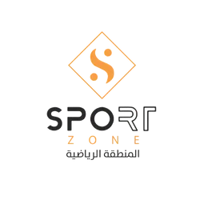

# 🖥️ Sport Zone - نسخة سطح المكتب (Electron)

<div align="center">



**🎉 الآن كبرنامج سطح مكتب كامل! 🎉**

`Windows` · `macOS` · `Linux`

</div>

---

## ✨ المميزات الجديدة

### 🖥️ برنامج مستقل:
- ✅ لا يحتاج متصفح
- ✅ أيقونة في سطح المكتب
- ✅ قائمة ابدأ (Windows)
- ✅ تطبيق في Applications (macOS)

### 🎨 مصمم بألوان Sport Zone:
- ✅ شعار Sport Zone كأيقونة
- ✅ ألوان برتقالي/ذهبي ورمادي
- ✅ واجهة عربية كاملة
- ✅ قوائم بالعربية

### ⚡ الأداء:
- ✅ سريع جداً
- ✅ يعمل offline
- ✅ قاعدة بيانات محلية
- ✅ آمن ومشفر

---

## 📦 ملفات التثبيت

### 🪟 Windows:
```
Sport-Zone-Setup-2.0.0.exe
```
- الحجم: ~100 MB
- متطلبات: Windows 10 أو أحدث
- ميزات:
  - اختيار مجلد التثبيت
  - اختصار سطح المكتب
  - قائمة ابدأ
  - إلغاء تثبيت سهل

### 🍎 macOS:
```
Sport-Zone-2.0.0.dmg
Sport-Zone-2.0.0-arm64.dmg (M1/M2)
```
- الحجم: ~120 MB
- متطلبات: macOS 10.15 أو أحدث
- ميزات:
  - سحب وإفلات للتثبيت
  - دعم Intel و Apple Silicon
  - أيقونة مخصصة

### 🐧 Linux:
```
Sport-Zone-2.0.0.AppImage
sport-zone-gym_2.0.0_amd64.deb
```
- الحجم: ~100 MB
- متطلبات: Ubuntu 20.04 أو ما يعادله
- ميزات:
  - AppImage: تشغيل مباشر
  - DEB: تثبيت على Debian/Ubuntu

---

## 🚀 التثبيت

### Windows:
1. حمّل `Sport-Zone-Setup-2.0.0.exe`
2. شغّل الملف
3. اتبع التعليمات
4. ابحث عن "Sport Zone" في قائمة ابدأ

### macOS:
1. حمّل `Sport-Zone-2.0.0.dmg`
2. افتح الملف
3. اسحب أيقونة Sport Zone إلى Applications
4. افتح من Applications

### Linux (AppImage):
```bash
chmod +x Sport-Zone-2.0.0.AppImage
./Sport-Zone-2.0.0.AppImage
```

### Linux (DEB):
```bash
sudo dpkg -i sport-zone-gym_2.0.0_amd64.deb
```

---

## 🎯 الاستخدام

### أول مرة:
1. افتح البرنامج
2. سيتم إنشاء قاعدة البيانات تلقائياً
3. سجّل الدخول:
   - البريد: `admin@sportzone.com`
   - الباسورد: `admin123`

### الصفحات:
- 🏠 لوحة التحكم
- 👥 إدارة المشتركين
- ➕ إضافة مشترك جديد
- 📊 التقارير (قريباً)

---

## 💾 قاعدة البيانات

### مكان الحفظ:

**Windows:**
```
%APPDATA%\sport-zone-gym\prisma\dev.db
```

**macOS:**
```
~/Library/Application Support/sport-zone-gym/prisma/dev.db
```

**Linux:**
```
~/.config/sport-zone-gym/prisma/dev.db
```

### النسخ الاحتياطي:
1. أغلق البرنامج
2. انسخ ملف `dev.db`
3. احفظه في مكان آمن

---

## 🎨 الألوان والتصميم

### ألوان Sport Zone:
```
البرتقالي/الذهبي: #E67E22
الرمادي الداكن: #2C3E50
الرمادي الفاتح: #f8fafc
```

### النوافذ:
- حجم افتراضي: 1400x900
- الحد الأدنى: 1200x700
- قابلة للتكبير والتصغير
- ملء الشاشة متاح

---

## ⌨️ اختصارات لوحة المفاتيح

### عامة:
- `Ctrl/Cmd + Q` - إنهاء البرنامج
- `Ctrl/Cmd + R` - إعادة تحميل
- `F11` - ملء الشاشة

### التكبير:
- `Ctrl/Cmd + Plus` - تكبير
- `Ctrl/Cmd + Minus` - تصغير
- `Ctrl/Cmd + 0` - الحجم الطبيعي

---

## 🔧 المشاكل الشائعة

### البرنامج لا يفتح (Windows):
- تأكد من Windows 10 أو أحدث
- شغّل كمسؤول
- تحقق من Windows Defender

### البرنامج لا يفتح (macOS):
- افتح System Preferences > Security
- اسمح بفتح التطبيقات من مطورين غير معتمدين

### قاعدة البيانات لا تعمل:
- أغلق البرنامج
- احذف مجلد البيانات
- افتح البرنامج مرة أخرى (سيتم إنشاء قاعدة جديدة)

---

## 🆕 التحديثات

### التحديث اليدوي:
1. حمّل النسخة الجديدة
2. ثبّتها فوق القديمة
3. بياناتك محفوظة تلقائياً

---

## 📊 المواصفات التقنية

### البرمجيات:
- **Electron** 27.x
- **Next.js** 14
- **React** 18
- **Prisma** 5
- **SQLite** (قاعدة البيانات)

### المتطلبات:
- **ذاكرة:** 4 GB RAM (الموصى به: 8 GB)
- **المعالج:** Intel/AMD 64-bit
- **المساحة:** 500 MB فارغة
- **الشاشة:** 1280x720 أو أكبر

---

## 🔒 الأمان والخصوصية

### ✅ آمن تماماً:
- قاعدة بيانات محلية (على جهازك فقط)
- لا يتصل بالإنترنت
- كلمات المرور مشفرة (bcrypt)
- لا يتم إرسال أي بيانات

---

## 🎉 الميزات الكاملة

### المرحلة 1 + 2:
- ✅ لوحة تحكم شاملة
- ✅ إدارة المشتركين
- ✅ إضافة مشترك (نموذج كامل)
- ✅ بحث متقدم
- ✅ تصفية حسب الحالة
- ✅ تفاصيل كاملة لكل مشترك
- ✅ سجل الاشتراكات
- ✅ سجل الحضور
- ✅ سجل المدفوعات
- ✅ إحصائيات فورية

### قريباً (المرحلة 3):
- ⏰ تسجيل الحضور السريع
- 📷 QR Code
- 📊 تقارير متقدمة

---

## 📞 الدعم

### الأدلة:
- `ELECTRON-GUIDE.md` - دليل شامل
- `ELECTRON-COMMANDS.md` - أوامر سريعة
- `README.md` - الدليل الرئيسي

### بناء من المصدر:
راجع `ELECTRON-GUIDE.md` للتفاصيل

---

## 📝 سجل التغييرات

### v2.0.0-electron (الحالي):
- ✨ تحويل إلى Electron
- ✨ برنامج سطح مكتب
- ✨ ملفات تثبيت لجميع الأنظمة
- ✨ قوائم عربية
- ✨ ألوان Sport Zone

### v2.0.0:
- ✨ إدارة المشتركين الكاملة
- ✨ 3 صفحات جديدة
- ✨ 7 API endpoints

### v1.0.0:
- ✨ لوحة التحكم
- ✨ قاعدة البيانات
- ✨ الباقات الافتراضية

---

## 🙏 شكر خاص

تم تطوير هذا النظام خصيصاً لـ **Sport Zone - المنطقة الرياضية**

---

<div align="center">

**© 2024 Sport Zone - المنطقة الرياضية**

🏋️ **إدارة احترافية لناديك الرياضي** 🏋️

**الإصدار:** 2.0.0-electron  
**الحالة:** ✅ مستقر وجاهز للإنتاج

</div>
